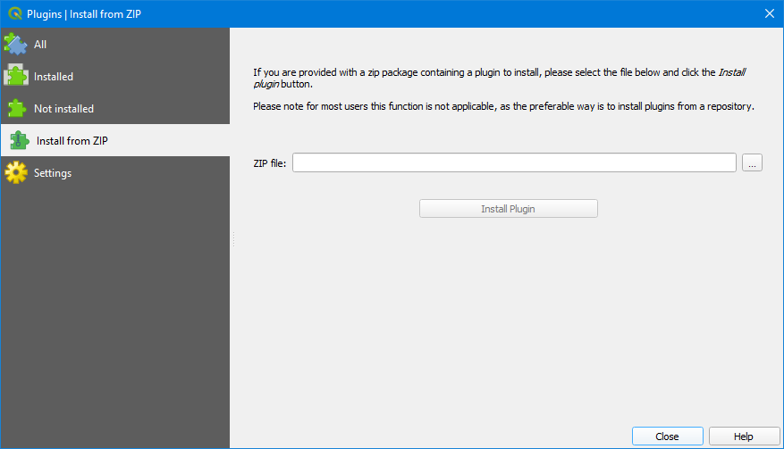

.. _installtion:

Installation
=====================

https://github.com/sandialabs/seat-qgis-plugin
Options:
- Clone the package (https://github.com/sandialabs/seat-qgis-plugin.git)
- Download the create_zip.sh

NetCDF4
---------------------

- run `C:\Program Files\QGIS 3.22.10\OSGeo4W.bat` as administrator.

  * Note replace QGIS 3.22.10 with the installed QGIS version
  * On windows run `C:\Program Files\QGIS 3.16\OSGeo4W.bat` as administrator.
  * Linux & MacOS - Open the Python console in QGIS and enter the commands below to determine where your Python install is:

- Obtain the python path: 

.. code-block:: python

   import sys
   print(sys.exec_prefix)

- Navigate to the python path and “pip install netcdf4”

QGIS
---------------------
- In QGIS, click on the plugins toolbar and select “Manage and Install Plugins”
- Select the Install from ZIP option.

- Navigate to the SEAT zip package.
- Click Install Plugin.
- The SEAT icon should appear in the toolbar.

.. figure:: media/SEAT_Toolbar.png
   :scale: 125 %
   :alt: SEAT icon in QGIS toolbar
   

- And as a Plugin menu option.
