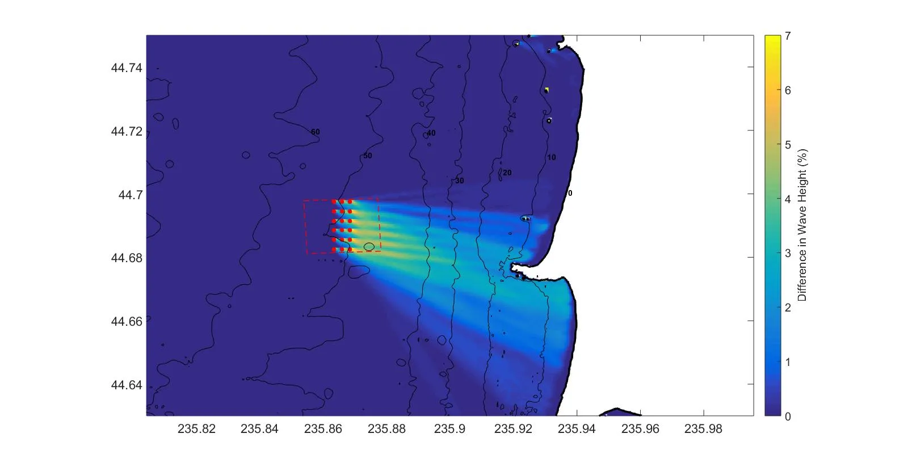
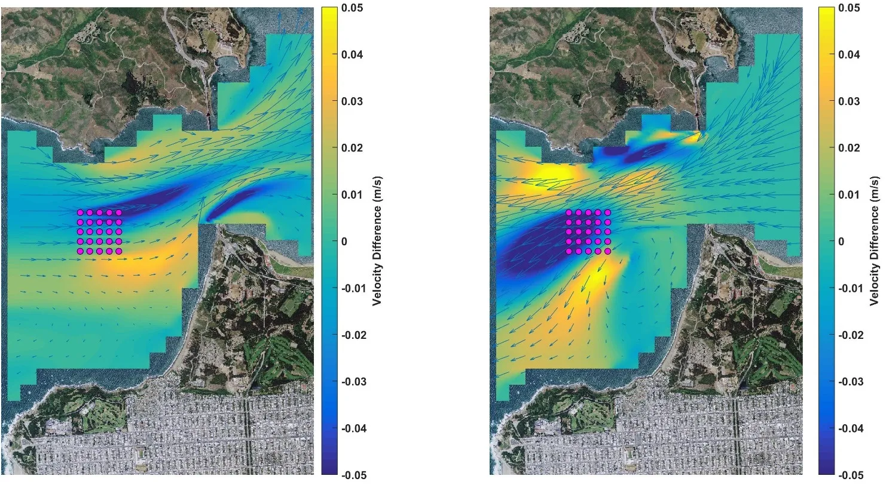
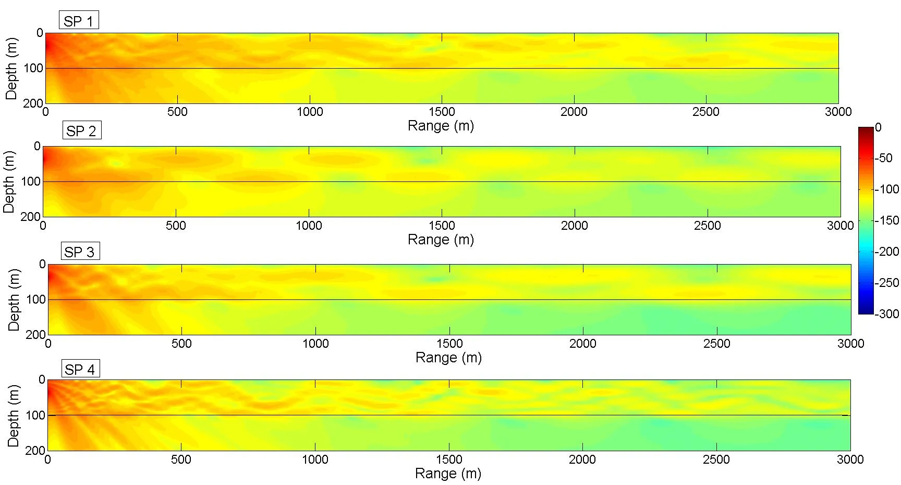

MHK-Friendly Tools
------------------

This project has developed a series of tools that can quantitatively describe MHK-driven changes due to wave energy converters (WECs) or current energy converters (CECs)to the physical and acoustic environment, specifically, for assessing potential changes incurred by operation of wave energy converter (WEC) and current energy converter (CEC) arrays, including potential changes to the ecosystem. Changes in wave propagation shoreward of a WEC array manifest as altered wave heights and spectra (both energy and directional) due to WEC-specific energy absorption efficiencies at distinct wave heights and frequencies. The resultant changes to the wave environment can alter coastal circulation, seabed dynamics, and beach profiles, thereby influencing coastal-zone ecological habitats, recreation, and coastal-management strategies. These changes can be both helpful (e.g., beneficial habitat and coastal protection) and potentially harmful (e.g., degraded habitat, recreational, and commercial use) to existing users of the coastal environment. Similarly, flow disruption due to the presence of CEC devices depends on local site conditions and device/array characteristics and is an issue that must be addressed and resolved prior to obtaining permits to deploy and operate in US waters. Furthermore, noise generated by MHK devices must not exceed existing regulations and conform to policies defining the maximum noise levels allowed that avoid harm or harassment to marine species. These regulations have recently been updated by NOAA and reinforce that distinct species at the same site are influenced by sound in different ways and that conclusions drawn for one site are not necessarily transferrable to other deployment locations. Tools developed by this project include:

SNL-SWAN
^^^^^^^^
SNL-SWAN is a modification of the open source	SWAN (Simulating WAves Nearshore) code developed by	TU Delft and includes the addition of a WEC Module which improves how SWAN accounts for power performance of Wave Energy Converters (WECs) and their effect on wave fields.

   
   Simulation of a WEC array in SNL-SWAN showing the difference in wave heights due to the presence of the array.   

SNL-Delft3D-CEC
^^^^^^^^^^^^^^^

SNL-Delft3D-CEC incorporates a state-of-the-art current energy conversion (CEC) module within both the structured grid and flexible mesh versions of the open-source Delft3D-FLOW software developed by Deltares. In partnership with Deltares, Sandia modifications include a CEC Module that simulates energy conversion (momentum withdrawal) by marine hydrokinetic (MHK) turbine or turbine-like devices including commensurate changes in turbulent kinetic energy and turbulent kinetic energy dissipation rate. SNL-Delft3D-CEC can be coupled to SNL-SWAN to simulate coastal circulation and evaluate the effects of wave energy converters (WEC) on the marine environment.

   Turbine array in the San Francisco Bay inlet simulated with SNL-Delft3D.
  

Paracousti
^^^^^^^^^^

Paracousti is an underwater sound propagation tool used to investigate changes to the pressures and particle velocities within the marine environment from arrays of current- and wave-energy converters. Paracousti solves the governing equations with a finite-difference, time-domain scheme that can be massively parallelized for use on high performance computing clusters.

   Simulation of sound pressure (SP) propagation from a simulated MHK source in Paracousti.

