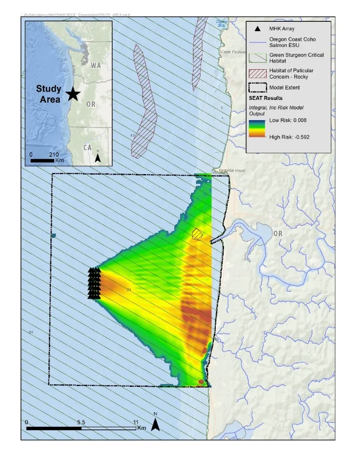

Overview
===========

.. raw:: html

   

Spatial Environmental Assessment Toolkit (SEAT)
------------------------------------------------

To accurately understand physical processes and their potential relationship to environmental stressors at a marine hydrokinetic (MHK) site, a Spatial Environmental Assessment Toolkit (SEAT) has been developed by combining the information from the SNL ‘MHK friendly’ tools as applicable and spatial analysis techniques to assess potential environmental risks. This toolkit has been used to assess changes to environmental conditions such as sediment mobility, larval motility, and bed elevation using the model results from the ‘MHK friendly’ tools. The quantification of these changes allows for an evaluation of MHK array configurations with respect to its potential environmental risk. This tool bridges the gap between regulators’ requirements and developers’ needs to optimize turbine array layouts that maximize power production, while minimizing unwanted environmental change.

The SEAT incorporates device specific parameters, site-specific hydrodynamic conditions, and local receptor information to assess the potential for environmental change within a system. Results from a successful SEAT application informs developers and regulators on the risk of environmental change associated with deploying a device or array in a site of interest. The Sandia developed state-of-the-science numerical models (SNL-SWAN, SNL-Delft3D-CEC, Paracousti) leveraged in the SEAT analysis can account for the effects of device size, shape, power extraction, sound generation, and, in the case of CEC devices, turbulence generation on hydrodynamics and interrelated processes. By assessing the changes to the system on multiple time scales, risk metrics specific to receptors of interest are developed and communicated on a range of spatial scales. Application of the tool has and continues to help address regulatory concerns about site-specific environmental responses to user-defined MHK array designs, thereby accelerating environmentally responsible deployment for power generation.

There are four modules available that assess different physical aspects of the impact of instruments on environmental conditions:

+-------------------------+---------------------------------------------------+
| Module                  | Description                                       |
+=========================+===================================================+
| **Shear Stress Module** | Analysis of spatial change in bed mobility        |
+-------------------------+---------------------------------------------------+
| **Velocity Module**     | Analysis of spatial change in larval motility     |
+-------------------------+---------------------------------------------------+
| **Acoustics Module**    | Analysis of acoustic propagation and thresholds   |
+-------------------------+---------------------------------------------------+
| **Power Module**        | Analysis of power generated by WEC/CEC array      |
+-------------------------+---------------------------------------------------+

   Map of risk of benthic disturbance due to presence of WEC array. The SEAT risk mapping can be linked with receptor descriptions to evaluate potential environmental risk.

