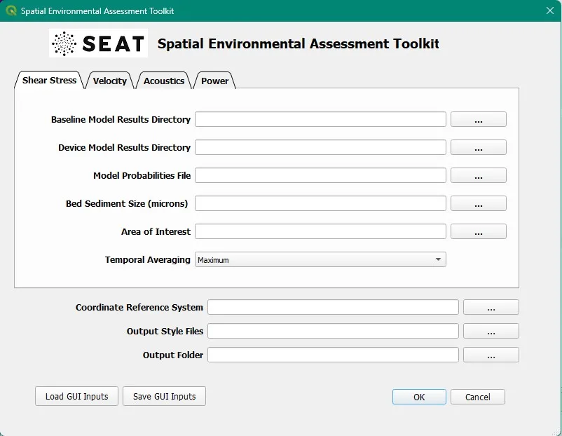
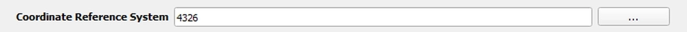
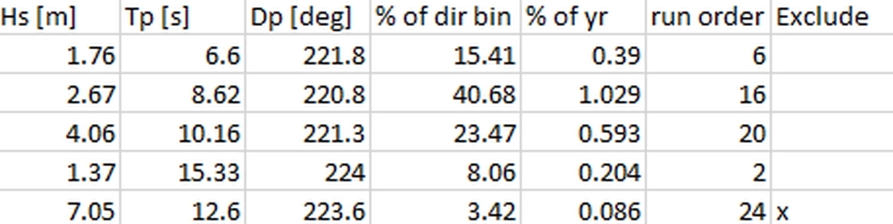
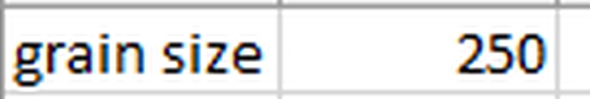

.. _gui:

Graphical User Interface
=============================

- The QGIS Graphic User Interface (GUI) allows the user to select the module/analysis to perform, the inputs, and the customized style files to display (see Appendix A).
- Upon installation of the SEAT package, an icon will appear in the plugin toolbar.

.. figure:: media/SEAT_Toolbar.webp
   :scale: 125 %
   :alt: SEAT icon in QGIS toolbar

- Click on the icon to bring up the SEAT GUI Interface

Stressor
--------

- To choose the analysis/data type in the "Select Stressor" Dropdown box.
- Currently 3 options exist

.. figure:: media/select_stressor.webp
   :scale: 100 %
   :alt: Selecting the stressor

- **Shear Stress Module** – analysis of spatial change in bed mobility
- **Velocity Module**	- analysis of spatial change in larval motility
- **ParAcousti Module** – analysis of acoustic propagation and thresholds

Coordinate Reference System
----------------------------

- The correct display and analysis of the data requires knowledge of the data’s coordinate reference system, sometimes not present in the data structure.

- Clicking the the three dots "..." will bring up the CRS selection window

.. figure:: media/coordinate_ref_sys_select.webp
   :scale: 100 %
   :alt: Coordinate Reference System selector

Model Results Directory
-----------------------

- There are two model result directories needed for the analysis, the baseline results directory and the model results director.

.. figure:: media/model_results_directory_input.webp
   :scale: 100 %
   :alt: Model Results Directory

- Select the directory containing the model results with devices and the directory containing the baseline (without devices) model results. These model results must be in netCDF format.

- The model results can have 2 formats.
  
  1. A concatenated single \*.nc file with the model run number as the first dimension [RunNo, Depth, X, Y]. (Only one file per directory if this format is used).
  2. Multiple files with naming format name_RunNum_map.nc, where RunNum must come before the map.nc and be separated by a single underscore on either side.

- The number of baseline model files must match the device model files.

Probabilities
-------------

.. figure:: media/probabilities_input.webp
   :scale: 100 %
   :alt: Probablities Input

- A single csv file with the run order and probability of each model conditions occurring. 
- This file is optional and will assume the _runorder_ in the naming convention (see device/baseline model slide) in the return interval in years.
- If a file is provided, it must include the columns 'run order' and '% of year'. Other columns such as wave height and period can be included but are ignored.
- An 'Exclude' column can be added which will ignore a run in the analysis.

  - Currently %of year is not rescaled to 100 if Exclude is included. 

ParAcousti
^^^^^^^^^^

- The paracousti file format differs from shear stress and velocity. 
- This file requires the following columns

  1. Paracousti File :the name of the paracousti .nc file
  2. Species Percent Occurrence File : .csv or .tif file
  3. Species Density File : .csv or .tif file
  4. % of yr: percent of year value

- Species Percent Occurrence File and Species Density File can be either a csv with required columns "latitude", "longitude", and either "percent" and/or "density". Other columns will be ignored.
- a geotif with the same epsg

Power Files Directory
---------------------

- The power files directory, contains the .OUT files from the power calculation at each device.  Power is calculated for each obstacle (single plane) unless a \*.pol file is included to georeferenced each obstacle. 

Receptor File
-------------

Shear Stress
^^^^^^^^^^^^

.. figure:: media/receptor_file_input.webp
   :scale: 100 %
   :alt: Receptor File

- A receptor file (.csv, or .tif) allows for additional criterion to be passed to each module. 

  - Shear stress : receptor is a \*.csv or geotif (\*.tif) of grain size in microns (µm). 
  
    * Geotif will be interpolated to the same grid points as the model files (structured or unstructured), must have same projection/datum.
    * The csv file currently only takes a single grain size and is formatted as below with no column headers.

Velocity
^^^^^^^^

- Velocity: receptor is a (.csv) or geotif of critical velocity in units of meters per second (m/s).
  
  - Geotif will be interpolated to the same grid points as the model files (structured or unstructured), must have same projection/datum.
  - The csv file currently only takes a critical velocity and is formatted as below with no column headers.

.. figure:: media/critical_velocity.webp
   :scale: 150 %
   :alt: Critical velocity

ParAcousti
^^^^^^^^^^

- ParAcousti: receptor is a \*.csv file with values indicating how to apply thresholds, grid scaling, and variables to use. 

  - species : optional but can be used for output
  - Paracousti Variable: Depending on the species, different variables might be needed and or different weightings. 
  - Threshold (db re 1 uPa): threshold above which negative impacts are expected. Units should match Paracousti Variable.
  - Depth Averaging (default DepthMax): 	

    * DepthMax: use the maximum value for each vertical column
    * DepthAverage: use the average value for each vertical column
    * Top: use the top/surface bin for each vertical column
    * Bottom: use the bottom/bed bin for each vertical column
  - species file averaged area (km2): the cumulative area over which each cell represents species percent and density (used to scale to each paracousti grid cell). Leave blank or set to 0 to prevent scaling. 

.. figure:: media/paracousti_receptor.webp
   :scale: 100 %
   :alt: ParAcousti Receptor

Secondary Constraint
--------------------

- Currently only used for paracousti and will be ignored for shear stress and velocity. 
- For Paracousti, this points to the directory containing species percent and species density files. Both must be present in the same folder. The names of each file and what conditions they apply to is in the Model Probabilities File.

Output Directory
----------------

.. figure:: media/output_directory_input.webp
   :scale: 100 %
   :alt: Output Directory

- Directory to save all processed analysis files to. This contains both geotifs and csv files.

Output Style Files
------------------

.. figure:: media/output_style_files_input.webp
   :scale: 100 %
   :alt: Output Style Files

- This is a .csv file pointing to the absolute file path for the QGIS style files to use for each module output.

  - Stressor and Velocity Style File csv, must include each row.

.. figure:: media/output_style_file_eg.webp
   :scale: 100 %
   :alt: Stressor Style File

..

  - ParAcousti

.. figure:: media/output_style_files_paracousti.webp
   :scale: 100 %
   :alt: Stressor Style File   

Save & Load Input
-----------------

- Once each desired field is populated, the file locations can be saved to a .ini file which can be reloaded. 
- Several example .ini files exist with the demo data. 
  
  - *FILE PATH MUST BE UPDATED*

  .. figure:: media/SEAT_input_complete_eg.webp
     :scale: 100 %
     :alt: Save & Load Input