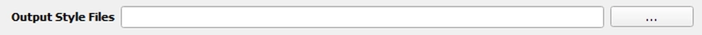

Output Style Files
------------------

This is a .csv file pointing to the absolute file path for the QGIS style files to use for each module output.

- Stressor and Velocity Style File csv, must include each row.

   +----------------------------+---------------------------------------------+
   | Type                       | Style                                       |
   +============================+=============================================+
   | Stressor                   | LayerStyle\\continuous_bar_bwr.qml          |
   +----------------------------+---------------------------------------------+
   | Receptor                   | LayerStyle\\receptor_blues.qml              |
   +----------------------------+---------------------------------------------+
   | Stressor with receptor     | LayerStyle\\continuous_bar_bwr.qml          |
   +----------------------------+---------------------------------------------+
   | Reclassified Stressor with | LayerStyle\\mobility_classification_bwr.qml |
   | receptor                   |                                             |
   +----------------------------+---------------------------------------------+
   | Secondary Constraint       | LayerStyle\\constraint_rc.qml               |
   +----------------------------+---------------------------------------------+

- ParAcousti

   +----------------+------------------------------------------------+
   | Type           | Style                                          |
   +----------------+------------------------------------------------+
   | Stressor       | LayerStyle\\acoustics_stressor_bluewhale.qml   |
   +----------------+------------------------------------------------+
   | Threshold      | LayerStyle\\acoustics_stressor_bluewhale.qml   |
   +----------------+------------------------------------------------+
   | Species Percent| LayerStyle\\acoustics_stressor_bluewhale.qml   |
   +----------------+------------------------------------------------+
   | Species Density| LayerStyle\\acoustics_stressor_bluewhale.qml   |
   +----------------+------------------------------------------------+

Please see :ref:`prepare_style_files` for a walk through on how to prepare style files.