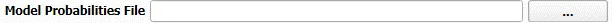

Probabilities
------------------------

The probabilities file, serves to enhance your analysis, providing insights into the run order and the likelihood of each model condition unfolding. Adhere to the prescribed naming convention (as delineated in the device/baseline model section). Note that this file correlates with the return interval in years.

For these types of analyses:

- `run order`: Represents the sequence of each condition.
- `% of year`: Indicates the probability of a given condition arising within a year.
- While you may include optional columns such as `wave height` or `period`, they won't impact the analysis.

For added flexibility, you can incorporate an 'Exclude' column, enabling you to earmark certain runs for omission.

.. note::

   If you include the 'Exclude' column, the `% of year` won't adjust to total 100%.

**Example of a Probabilities Input**

+------+--------+--------+-------------+---------+-----------+---------+
| Hs[m]| Tp[s]  | Dp[deg]| % of dir bin| % of yr | run order | Exclude |
+------+--------+--------+-------------+---------+-----------+---------+
| 1.76 |   6.6  | 221.8  |    15.41    |   0.39  |    6      |         |
+------+--------+--------+-------------+---------+-----------+---------+
| 2.67 |   8.62 | 220.8  |    40.68    |   1.029 |   16      |         |
+------+--------+--------+-------------+---------+-----------+---------+
| 4.06 |  10.16 | 221.3  |    23.47    |   0.593 |   20      |         |
+------+--------+--------+-------------+---------+-----------+---------+
| 1.37 |  15.33 | 224    |    8.06     |   0.204 |    2      |         |
+------+--------+--------+-------------+---------+-----------+---------+
| 7.05 |  12.6  | 223.6  |    3.42     |   0.086 |   24      |    x    |
+------+--------+--------+-------------+---------+-----------+---------+

Key:

- 'Hs': Wave height.
- 'Tp': Wave period.
- 'Dp': Direction.
- '% of dir bin': Proportion within a direction bin.
- '% of yr': Percentage of the year.
- 'run order': Execution sequence.
- 'Exclude': Designation for excluding runs.

