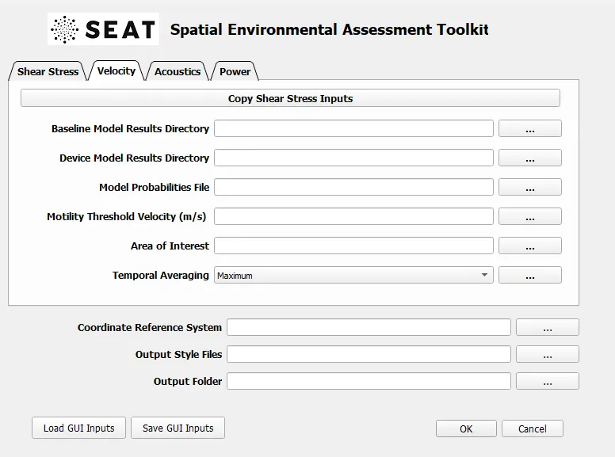

Velocity
===========

Investigates the spatial changes in larval motility.

.. toctree::
   :maxdepth: 1

   01_model_results_dir
   02_probabilities.rst
   03_larval_motility.rst
   04_risk_layer.rst
   05_temporal_avg.rst