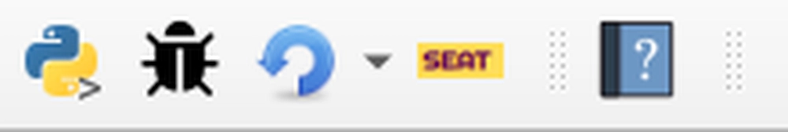

.. _installtion:

Installation
=====================

To successfully install the SEAT QGIS plugin follow this guide through the process of installing the software required for running SEAT and SEAT itself. It should be noted, that outside of software requirements, SEAT requires model data to be brought into the QGIS environment. This is covered in the models section, and examples are provided in the tutorial section, which users can use to get started with SEAT. The software requirements are listed below. The model data requirements are listed in the modules section.

1. Software Requirements
------------------------

QGIS software (version 3.16 or later) is mandatory for installing SEAT. It serves as the platform on which SEAT operates, enabling users to interact with various model files and execute environmental analysis tasks.

- `QGIS <https://www.qgis.org/en/site/forusers/download.html>`_ >= 3.16

2. Install NetCDF4 In QGIS
----------------------------

After acquiring the necessary software, users must then install netCDF4 within QGIS. Note that QGIS uses its own python library separate from any other python environments you may use. As such, the following will guide you through installing NetCDF4 in the QGIS python environment. The process varies between Windows and macOS/Linux. The following are the detailed steps for both Operating Systems:

Windows
^^^^^^^

1. Open the OSGeo4W Shell as Administrator (Searh for OSGeo4W Shell)
2. Run the following command to install netCDF4:

   .. code-block:: python

      pip install netCDF4

macOS/Linux
^^^^^^^^^^^

1. Open QGIS.
2. Open the Python Console within QGIS. You can do this by going to `Plugins` > `Python Console`, or by pressing `Ctrl + Alt + P`.
3. Once the Python Console is open, try importing `netCDF4` and print its version:

   .. code-block:: python

      import sys
      print(sys.exec_prefix)

4. Open a system terminal and navigate to the Python path printed in the previous step.

   .. code-block:: sh

      cd /path/to/python

5. Install `netCDF4` using `pip`:

   .. code-block:: sh

      python -m pip install netCDF4

Check NetCDF4 Installation (Optional)
^^^^^^^^^^^^^^^^^^^^^^^^^^^^^^^^^^^^^
Check that the above worked in QGIS by running the following in the Python Console:

   .. code-block:: python

      import netCDF4
      print(netCDF4.__version__)      

If the above worked, you should see the version of netCDF4 printed in the console. If you see an error, try closing and reopening QGIS and trying again. If you still see an error, open an issue on the GitHub.

3. Download SEAT
----------------

Download the **seat_qgis_plugin.zip** from the latest release

https://github.com/sandialabs/seat-qgis-plugin/releases/

4. Install SEAT in QGIS
--------------------------------

1. In QGIS, click on the plugins toolbar and select “Manage and Install Plugins...”
2. Select the Install from ZIP option.

   .. figure:: media/installPlugin.webp
      :scale: 60 %
      :alt: Install from ZIP

3. Navigate to the SEAT zip package.
4. Click Install Plugin.
5. The SEAT icon should appear in the toolbar and as a Plugin menu option.

   
   If you see the SEAT icon you have succesfully install SEAT.