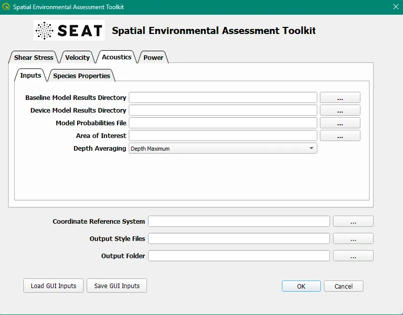

Acoustics
===========

ParAcousti Module: Examines acoustic propagation and its thresholds.

.. toctree::
   :maxdepth: 1
   :hidden:

   01_inputs.rst
   02_probabilities.rst
   03_species_properties.rst
   04_paracousti_preprocessing.rst
   05_risk_layer.rst
   06_depth_avg.rst

