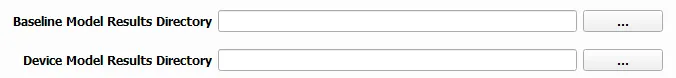
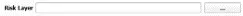
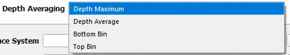

.. _02_inputs:

Inputs
-------

Model Results Directories
^^^^^^^^^^^^^^^^^^^^^^^^^^^^

The SEAT QGIS plugin uses two distinct directories from your model results:

1. **Baseline Results Directory**: Contains the model results without any devices. If left blank, a 0dB baseline will be assumed.
2. **Model Results Directory**: Contains the model results with devices.

The accepted formats for the model results:

1. Multiple files, each named in the format: `name_condition.nc`.

   - `name` is the common prefix for all file (e.g., `pacwave_3DSPLs`).
   - `run` is the run scenario designated the type of environmental condition (e.g., `Hw0.5`)

.. _paracousti_input_files:

.. code-block:: none
   :caption: Input files structure
      
      DEMO
      ├───pacwave
      │   ├───paracousti_files
      │   │   ├───pacwave_3DSPLs_Hw0.5.nc
      │   │   ├───pacwave_3DSPLs_Hw1.0.nc
      │   │   ├───pacwave_3DSPLs_Hw1.5.nc
      │   │   ├───pacwave_3DSPLs_Hw2.0.nc

.. note::

   - All model results are in the `netCDF` format.
   - The number and filename of baseline model files should be identical to the number of device model files to maintain consistency in your analysis.

Probabilities
^^^^^^^^^^^^^^

The probabilities file defines the likelihood of each model condition (i.e., `Hw0.5`) occurring. Both shear and stress velocity have probability files, but the format is different for acoustics than the shear and stress velocity modules. 
Note that this file correlates with the return interval in years.

.. figure:: ../../media/probabilities_input.webp
   :scale: 100%
   :alt: Interface depicting the Probabilities Input in SEAT's GUI.

**File Specifications**:

- If you're using .csv for the Species Percent Occurrence and Species Density Files, they must contain the essential columns: "latitude", "longitude", and either "percent" and/or "density". All supplementary columns will be overlooked.
- If you opt for a .tif format for the aforementioned files, ensure consistency in the EPSG code across them.
In this case, the probabilities file also points to the species percent occurrence and species density files as seen in :ref:`03_species_properties`.

**Example of a Probabilities Input**

.. code-block:: text
   :caption: paracousti_probabilities.csv

   Paracousti File,Species Percent Occurance File,Species Density File,% of yr
   pacwave_3DSPLs_Hw0.5.nc,whale_watch_predictions_2021_01.csv,whale_watch_predictions_2021_01.csv,0
   pacwave_3DSPLs_Hw1.0.nc,whale_watch_predictions_2021_02.csv,whale_watch_predictions_2021_02.csv,2.729
   pacwave_3DSPLs_Hw1.5.nc,whale_watch_predictions_2021_03.csv,whale_watch_predictions_2021_03.csv,20.268
   pacwave_3DSPLs_Hw2.0.nc,whale_watch_predictions_2021_04.csv,whale_watch_predictions_2021_04.csv,39.769
   pacwave_3DSPLs_Hw2.5.nc,whale_watch_predictions_2021_05.csv,whale_watch_predictions_2021_05.csv,13.27
   pacwave_3DSPLs_Hw3.0.nc,whale_watch_predictions_2021_06.csv,whale_watch_predictions_2021_06.csv,3.49
   pacwave_3DSPLs_Hw3.5.nc,whale_watch_predictions_2021_07.csv,whale_watch_predictions_2021_07.csv,11.212
   pacwave_3DSPLs_Hw4.0.nc,whale_watch_predictions_2021_08.csv,whale_watch_predictions_2021_08.csv,0.593
   pacwave_3DSPLs_Hw4.5.nc,whale_watch_predictions_2021_09.csv,whale_watch_predictions_2021_09.csv,1.813
   pacwave_3DSPLs_Hw5.0.nc,whale_watch_predictions_2021_10.csv,whale_watch_predictions_2021_10.csv,6.462
   pacwave_3DSPLs_Hw5.5.nc,whale_watch_predictions_2021_11.csv,whale_watch_predictions_2021_11.csv,0
   pacwave_3DSPLs_Hw6.0.nc,whale_watch_predictions_2021_12.csv,whale_watch_predictions_2021_12.csv,0
   pacwave_3DSPLs_Hw6.5.nc,whale_watch_predictions_2021_01.csv,whale_watch_predictions_2021_01.csv,0
   pacwave_3DSPLs_Hw7.0.nc,whale_watch_predictions_2021_02.csv,whale_watch_predictions_2021_02.csv,0.086

Key:

- `ParAcousti File`: The name of the ParAcousti .nc file.
- `Species % Occurrence File`: Either a .csv or .tif file indicating species percent occurrence.
- `Species Density File`: Either a .csv or .tif file detailing species density.
- `% of yr`: Represents the percentage of the year.

Risk Layer (Optional)
^^^^^^^^^^^^^^^^^^^^^^

The risk layer is a receptor file that serves as an additional input to each module and designates which layers are sensitive and would be affected by the acoustics. It must be a numerically classified .tif format, the same as what is used in the shear stress and velocity modules.

   Represents a layer to evaluate change against. Examples include vegetation habitat, marine ecosystems, contaminated sediments, marine protected areas, or archaeological artifacts.

- **File Type**: Supports geotiff (.tif) file format.

  - **Geotiff Details**:
    - Must have the same projection and datum as the model files.
    - Will be nearest-neighbor interpolated to align with the model files' grid points (structured/unstructured).
    - Must be integer classified, e.g., (0 = 'Kelp', 1 = 'Rock')

Depth Averaging
^^^^^^^^^^^^^^^^

The Depth Averaging drop down box serves as an option to determine the depth sampling of the model results.

The depth selection options for acoustics are:

1. **Depth Maximum**: Maximum value over depth.
2. **Depth Average**: Mean value over depth.
3. **Bottom Bin**: Value from bottom bin.
4. **Top Bin**: Value from top bin.