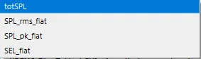
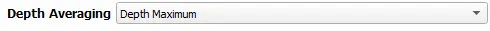

.. _03_species_properties:
Species Properties
--------------------

The species properties section of the SEAT QGIS plugin allows users to specify the species spatial probability/density directory and the species file averaged area.

**Weighting**: The weighting dropdown shows the signal weighted metrics within the device model results files (see Paracousti Pre-Processing). 

.. figure:: ../../media/weighting_dropdown.webp
   :scale: 100 %
   :alt: Dropdown menu showing the signal weighted metrics

**Acoustic Metric**: Unweighted and weighted variables present in the device model results files. Options change depending on weighting selected (see Paracousti Pre-Processing).

Unweighted metrics:

Weighted metrics:

**Acoustic Threshold Value**: Threshold above which negative impacts are expected. The units update to match Acoustic Metric selected.

.. figure:: ../../media/acoustic_threshold_value.webp
   :scale: 100 %
   :alt: Input box for the acoustic threshold value.

Species Spatial Probability / Density Directory
^^^^^^^^^^^^^^^^^^^^^^^^^^^^^^^^^^^^^^^^^^^^^^^^

This input specifies the directory where the
species present and species density files are located. Both files must be located within the same directory.

- **Directory Structure**:

  - The designated directory should contain both the Species Percent and Species Density files.

- **File Naming**:

  - Detailed information regarding the naming conventions of these files and the conditions they pertain to can be found in the Model Probabilities File.

.. figure:: ../../media/acoustics_species_spatial_probability_density_dir.webp
   :scale: 100 %
   :alt: Secondary Constraint

The Species Percent and Species Density files are located in the directory as specified by the "Secondary Constraint". 
For example, in the Paracousti Demo files, there is a directory called "species" that contains the Species Percent and Species Density files. The Species Percent and Species Density files have the names as specifed above e.g., "WhaleWatchPredictions_2021_01.csv". Opening one of these files in a text editor shows the following:

**Example:**

.. code-block:: text
   :caption: `WhaleWatchPredictions_2021_01.csv <../../_files/example.csv>`_

   "","longitude","latitude","bathy","bathyrms","sst","chl","ssh","sshrms","month","year","fitmean","sdfit","percent","density","sddens","upper","lower"
   "1",225,30,-4878.5,145.013092041,19.3042380721481,0.131973730461833,0.10315625,NA,1,2021,NA,NA,NA,NA,NA,NA,NA
   "2",225,30.25,-4845.25,94.5832061768,19.1984631521385,0.139408998412115,0.1158875,NA,1,2021,NA,NA,NA,NA,NA,NA,NA
   "3",225,30.5,-4792,136.986038208,19.1373958299844,0.138623459694399,0.1290125,NA,1,2021,NA,NA,NA,NA,NA,NA,NA
   ...
   "6235",245,48.5,NA,NA,NA,NA,NA,NA,1,2021,NA,NA,NA,NA,NA,NA,NA
   "6236",245,48.75,NA,NA,NA,NA,NA,NA,1,2021,NA,NA,NA,NA,NA,NA,NA
   "6237",245,49,NA,NA,NA,NA,NA,NA,1,2021,NA,NA,NA,NA,NA,NA,NA

Key:

- `ParAcousti File`: The name of the ParAcousti .nc file.
- `Species % Occurrence File`: Either a .csv or .tif file indicating species percent occurrence.
- `Species Density File`: Either a .csv or .tif file detailing species density.
- `% of yr`: Represents the percentage of the year.

**Species File Averaged Area (km^2)**

The grid size of the species percent and density files. This is used for scaling to each ParAcousti grid cell. Leave blank or set to 0 to prevent scaling.

.. figure:: ../../media/species_file_averaged_area.webp
   :scale: 100 %
   :alt: Spatial Probability/Density Grid Resolution

Depth Averaging
^^^^^^^^^^^^^^^^

The Depth Averaging drop down box serves as an option to determine the depth sampling of the model results.

The depth selection options for acoustics are:

1. **Depth Maximum**: Maximum value over depth.
2. **Depth Average**: Mean value over depth.
3. **Bottom Bin**: Value from bottom bin.
4. **Top Bin**: Value from top bin.