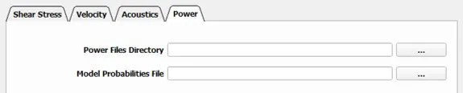

Power
===========
   
The power files directory contains the .OUT files from the power calculation at each device. Power is calculated for each obstacle (single plane) unless a \*.pol file is included to georeference each obstacle.

.. toctree::
   :maxdepth: 1

   01_power_dir.rst
   02_probabilities.rst