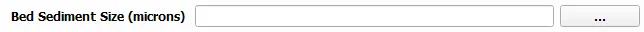

Bed Sediment Size (Optional)
--------------------------------

The bed sediment size is a receptor file that serves as an additional input to each module, which can either be in .csv or .tif format. 

Represents grain size, measured in microns (µm).

- **File Type**: Supports .csv or geotiff (.tif) file formats.
  
  - **Geotiff Details**:

    - Must have the same projection and datum as the model files.
    - Will be interpolated to align with the model files' grid points (structured/unstructured).

  - **CSV Details**:

    - Supports only a single grain size value.
    - No column headers required; the file should contain the grain size value directly.
    - E.g.:

    
    +-------------+-------+
    | grain size  |  250  |
    +-------------+-------+
