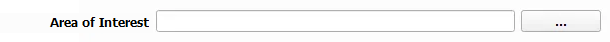

Area of Interest (Optional)
--------------------------------

The Area of Interest is a receptor file that serves as an additional input to each module. It must be a numerically classified .tif format. 

Represents a layer to evalute change against. Examples include vegetation habitat, marine ecosystems, contaminated sediments, marine protected areas, or archaeological artifacts.

- **File Type**: Supports geotiff (.tif) file format.
  
  - **Geotiff Details**:

    - Must have the same projection and datum as the model files.
    - Will be nearest-neighbor interpolated to align with the model files' grid points (structured/unstructured).
    - Must be integer classified eg. (0 = 'Kelp', 1 = 'Rock')