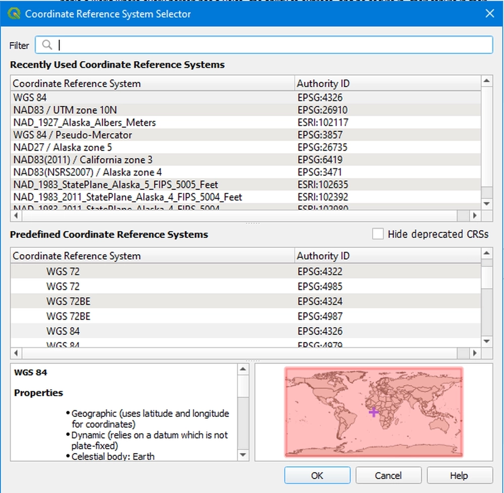

Coordinate Reference System
---------------------------------------------

For accurate display and analysis, it's essential to specify the coordinate reference system (CRS) of your data.

1. To set or change the CRS, look for the input box with three adjacent dots ("...") as shown below:

.. figure:: ../../media/coordinate_ref_sys_input.webp
   :scale: 100 %
   :alt: Input box with the three dots icon indicating CRS setting.

2. Once inside the selection window, you can choose the appropriate CRS from the list. For instance, if you're working with data from the United States, you might consider selecting "WGS 84". Additionally, if you know the name or code of the CRS, use the search bar for quicker access. After selecting the desired CRS, click "OK" to confirm your choice. You should then see the CRS ID reflected in the input box.

By setting the correct CRS, you ensure your data aligns properly with other geographic data layers in QGIS, guaranteeing spatial accuracy throughout your analysis.
