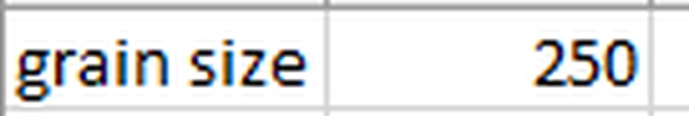
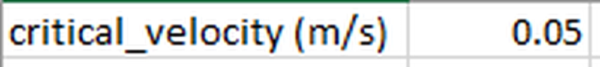
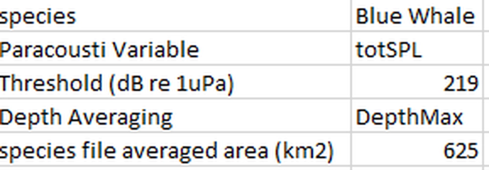

Receptor File Input (Optional)
--------------------------------

The receptor file serves as an additional input to each module, which can either be in .csv or .tif format. 

.. figure:: ../../media/receptor_file_input.webp
   :scale: 100 %
   :alt: Receptor File

1. Shear Stress Receptor
^^^^^^^^^^^^^^^^^^^^^^^^

- **File Type**: Supports .csv or geotiff (.tif) file formats.
  
- **Content**: Represents grain size, measured in microns (µm).

  - **Geotiff Details**:
    - Interpolated to align with the model files' grid points (structured/unstructured).
    - Must have the same projection and datum as the model files.

  - **CSV Details**:
    - Supports only a single grain size value.
    - No column headers required; the file should contain the grain size value directly.

2. Velocity Receptor
^^^^^^^^^^^^^^^^^^^^

Represents critical velocity, measured in meters per second (m/s).

- **File Type**: Supports .csv or geotiff (.tif) file formats.

  - **Geotiff Details**:
    
    - Interpolated to align with the model files' grid points (structured/unstructured).
    - Must have the same projection and datum as the model files.

  - **CSV Details**:
    
    - Supports only a single critical velocity value.
    - No column headers required; the file should contain the critical velocity value directly.

3. ParAcousti Receptor
^^^^^^^^^^^^^^^^^^^^^^^^

Contains values indicating thresholds, grid scaling, and variable selections. 

- **File Type**: Supports only .csv file format.

  - **Species**: Optional; can be used for output.
  - **ParAcousti Variable**: Variables and weightings may vary depending on species.
  - **Threshold (db re 1 uPa)**: Threshold above which negative impacts are expected. Units should match Paracousti Variable.
  - **Depth Averaging** (Default: DepthMax):

    - DepthMax: Use the maximum value for each vertical column.
    - DepthAverage: Use the average value for each vertical column.
    - Top: Use the top/surface bin for each vertical column.
    - Bottom: Use the bottom/bed bin for each vertical column.
  
  - **Species File Averaged Area (km²)**: Represents cumulative area for each cell regarding species percent and density; used for scaling to each paracousti grid cell. Leave blank or set to 0 to prevent scaling. 

