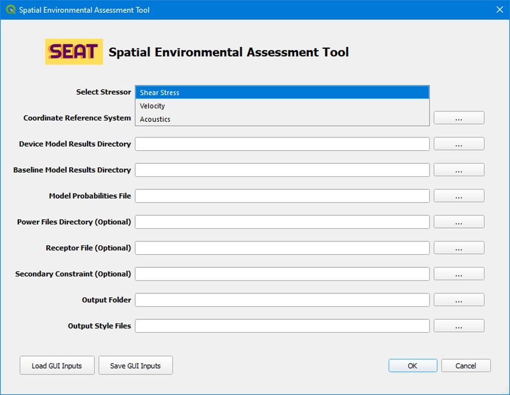

Stressor Selection
------------------

In SEAT, the stressor determines the type of analysis or data to be used. You can select your desired stressor from the "Select Stressor" dropdown menu. There are three available options:

1. **Shear Stress Module**: Analyzes the spatial changes in bed mobility.
2. **Velocity Module**: Investigates the spatial changes in larval motility.
3. **ParAcousti Module**: Examines acoustic propagation and its thresholds.

.. important::
   Remember, only one stressor model can be run at a time. Therefore, it's crucial to save your inputs (using the save option in the bottom left) before initiating a model analysis.

