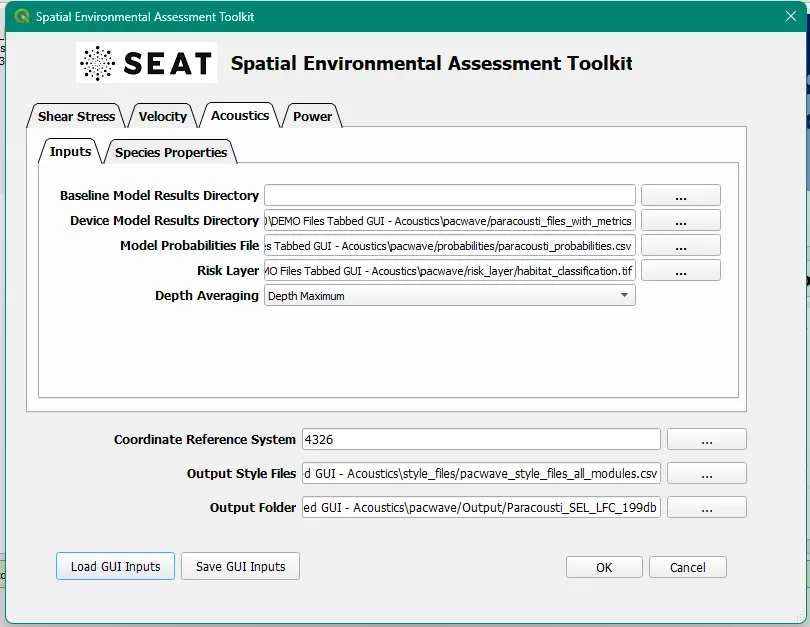
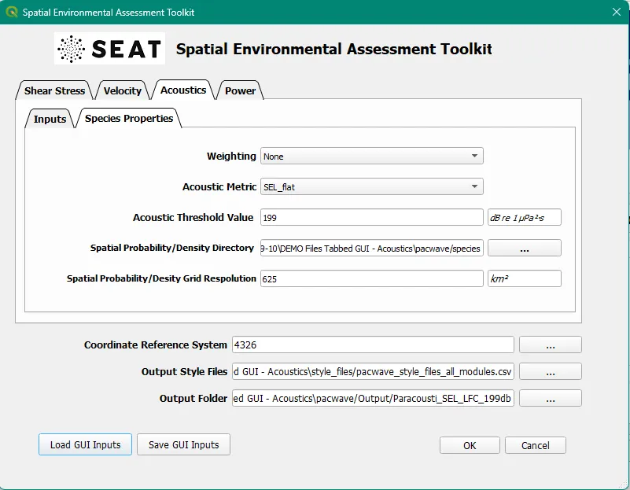

Acoustic Effects
^^^^^^^^^^^^^^^^

The acoustic effects from the WEC array at PacWave can be evaluated using the Acoustic module in the SEAT GUI. This module reads in individual ParAcousti model .nc files that correspond to wave conditions. 
At this point you should have already setup the input files and style files as detailed in :ref:`prepare_tutorial_files`.

**Paracousti Pre-Processing**

If a specific species is of interest, pre-process the Paracousti output files using the :ref:`01_paracousti_preprocessing` section of the SEAT QGIS plugin.
The pre-processing routine applies weighting functions to the acoustic signal, and save out files to a specified directory.
For this tutorial the input files are already pre-processed, however, if you'd like to use the pre-processing routine, 
specify the following directories within the pre_processing script:

.. code-block:: python

   paracousti_directory = r"local_path\DEMO_acoustics\pacwave\paracousti_files\\"  
   save_directory = r"local_path\DEMO_acosutics\pacwave\paracousti_files_with_metrics\\"  

Where ``local_path`` is the local path to the DEMO files on your machine.

**QGIS Dialog**

There are two tabs: the **Inputs** tab and the **Species Properties** tab.

Inputs
+++++++++++++++++

The :ref:`02_inputs` section of the SEAT QGIS plugin allows users to specify the model results directories and the probabilities file.

To run this demonstration, use the **Load GUI Inputs** button located at the bottom left of the SEAT GUI, navigate to :file:`DEMO_acoustics/pacwave/`, and there will be three files available to choose from:

    - **acoustics_module_SEL_199db_threshold.ini**: Sound exposure level with a 199db threshold
    - **acoustics_module_SEL_HFC_173db_threshold.ini**: Sound exposure level for high frequency ceteceans with a 173db threshold
    - **acoustics_module_SEL_LFC_199db_threshold.ini**: Sound exposure level for low frequency ceteceans with a 199db threshold
    - **acoustics_module_SPL_150db_threshold.ini**: Sound pressure level with a 150db threshold
    - **acoustics_module_SPL_219dB_threshold.ini**: Sound pressure level with a 219db threshold

Click on **acoustics_module_SEL_199db_threshold.ini**, and click OK to load the inputs. If you need detailed instructions on how to load inputs, 
please refer to the :ref:`save_load_config` section in the :ref:`seat_qgis_plugin` documention. All fields for both tabs will be filled out with the appropriate information.

   - **Baseline results directory** contains the baseline conditions which are the model results without any devices present. If left blank, 0 dB will be assumed.
   - **Device Model Results Directory** contains the model results with the devices.
   - **Probabilities File** defines the likelihood of each model condition occurring.
   - **Risk Layer File** contains spatial classifications used to evaluate the impact of the devices on the environment.
   - **Depth Averaging** option allows the user to specify the depth averaging method for the model results.

.. Note::
   Your paths will differ from the ones shown in the example below. If you get an error, make sure that the `.ini` files are pointing to the right path locations.
   

Species Properties
+++++++++++++++++++++

The :ref:`03_species_properties` section of the SEAT QGIS plugin allows users to specify the species spatial probability/density directory and the species file averaged area.

.. note::
   The plugin may take several minutes to run depending on the machine.

Output
""""""""

For a given probability of occurrence of each wave condition, the combined annual acoustic effects is estimated. 
SEAT generates a similar stressor layer consisting of the difference between the acoustic effects with and without the array. 
With a provided receptor file which consists of information regarding the species, threshold value, weighting, and variable used, a threshold map is generated as a percentage of time (based on the probability distribution) that a threshold will be exceeded. For demonstration purposes, an artificially low threshold is used to generate the percent exceeded threshold figure below.

Once the plugin has finished running (which might take several minutes), several output files will appear in the navigation pane:

.. list-table:: 
   :widths: 50 50
   :class: image-matrix

   * - .. image:: ../../media/qgis_navigation.webp
         :scale: 125%
         :alt: Layers
         :align: center

       .. raw:: html

          
Baseline acoustic signal, here 0

     - .. image:: ../../media/acoustic_stressor_non_probabilistic_qgis_navigation.webp
         :scale: 125 %
         :alt: Risk Layer
         :align: center

       .. raw:: html

          
With Devices acoustic signal

There are two groups of files: ``Acoustic Stressor - Probabilistic`` and ``Acoustic Stressor - Non-Probabilistic``. 
The ``Acoustic Stressor - Probabilistic`` contains the analysis with all the model runs combined via the weights, 
while the ``Acoustic Stressor - Non-Probabilistic`` contains the analysis for each weighted model run. The output files are the same with the model run name concated onto the filename like so:

There are four types of output files:

  - **paracousti_without_devices.tif**: The probability weighted signal without devices (baseline weighted by the probability that an environmental condition will occur)
  - **paracousti_with_devices.tif**: The probability weighted signal with devices
  - **paracousti_stressor.tif** : The difference between with devices and baseline models results. 
  - **species_threshold_exceeded** : the probability that the acoustic signal generated by the device will exceed the species-specific threshold in a given 24 hour period. Takes into account the model weights for different model conditions.
  - **species_percent** : for a given location, if the the device exceeds a threshold, the likelihood the species will be present.
  - **species_density** : for a given location, if the the device exceeds a threshold, the number of individuals present.
  - **paracousti_risk_layer** : the risk layer input provided, cropped to the location of interest.

.. list-table:: 
   :widths: 50 50
   :class: image-matrix

   * - .. image:: ../../media/paracousti_without_devices.webp
         :scale: 125%
         :alt: Layers
         :align: center

       .. raw:: html

          
Baseline acoustic signal, here 0

     - .. image:: ../../media/paracousti_with_devices.webp
         :scale: 125 %
         :alt: Risk Layer
         :align: center

       .. raw:: html

          
With Devices acoustic signal

   * - .. image:: ../../media/paracousti_stressor.webp
         :scale: 125 %
         :alt: Risk Layer
         :align: center

       .. raw:: html

          
Stressor: The difference between with and without devices

     - .. image:: ../../media/species_threshold_exceeded.webp
         :scale: 125 %
         :alt: Species Threshold Exceeded
         :align: center

       .. raw:: html

          
Species Threshold Exceeded. Takes into account the signal generated by the devices and Species specific threshold.
          Ranges from 0-100, here is higher at the corners of the array (97%), and lower at the center (around 57%) 

   * - .. image:: ../../media/species_percent.webp
         :scale: 125 %
         :alt: Calculated Paracousti
         :align: center

       .. raw:: html

          
Percent Species Exceeded: The likelihood the species would be present in a location is exceeded. Uses the spatial probability/density file  that is specified in the Species Tab as well as the threshold limit 

     - .. image:: ../../media/species_density.webp
         :scale: 125 %
         :alt: Calculated Paracousti
         :align: center

       .. raw:: html

          
Species Density: the number of marine species expected to be found in a given area at a given time

Note that in this example, the baseline is 0, and the threshold is set to 199dB. Since the baseline is 0, the stressor is equal to the "acousti_devices_present." 
For the non-probabilistic files, there are different paracousti stressors for each model run. The model run with a higher Hw0.5 has a higher paracousti signal than the model run with the lower Hw7.0.

.. list-table:: 
   :widths: 50 50
   :class: image-matrix

   * - .. image:: ../../media/paracousti_with_devices_pacwave_3DSPLs_Hw0.5.webp
         :scale: 125 %
         :alt: Layers
         :align: center

       .. raw:: html

          
Hw0.5

     - .. image:: ../../media/paracousti_with_devics_pacwave_3DSPLs_Hw7.0.webp
         :scale: 125 %
         :alt: Risk Layer
         :align: center

       .. raw:: html

          
Hw7.0

**Output Files**

.csv and .tif Output files can be found in the specifed Output folder. Note that the * in the filenames are placeholders for the model run names.

.. code-block::

   Output
   └───paracousti_sel_199db
       └───Acoustics Module
            paracousti_risk_layer.tif
            paracousti_stressor.csv
            paracousti_stressor_pacwave_*.csv
            paracousti_stressor_pacwave_*.tif
            paracousti_stressor_at_paracousti_risk_layer.csv
            paracousti_stressor_pacwave_*_*_at_paracousti_risk_layer.csv
            paracousti_without_devices.csv
            paracousti_without_devices_pacwave_*.tif
            paracousti_with_devices.csv
            paracousti_with_devices.tif
            paracousti_with_devices_pacwave_*.csv
            paracousti_with_devices_pacwave_*.tif
            species_density.csv
            species_density.tif
            species_density_at_paracousti_risk_layer.csv
            species_density_pacwave_*.csv
            species_density_pacwave_*.tif
            species_density_at_pacwave_*_paracousti_risk_layer.csv
            species_percent_pacwave_*.csv
            species_percent_pacwave_*.tif
            species_percent_pacwave_*_at_paracousti_risk_layer.csv
            species_percent.csv
            species_percent.tif
            species_percent_at_paracousti_risk_layer.csv
            species_percent_pacwave_*.csv
            species_percent_pacwave_*.tif
            species_percent_pacwave_*_at_paracousti_risk_layer.csv
            species_threshold_exceeded.csv
            species_threshold_exceeded.tif
            species_threshold_exceeded_at_paracousti_risk_layer.csv
            species_threshold_exceeded_pacwave_*.csv
            species_threshold_exceeded_pacwave_*.tif
            species_threshold_exceeded_pacwave_*_at_paracousti_risk_layer.csv

