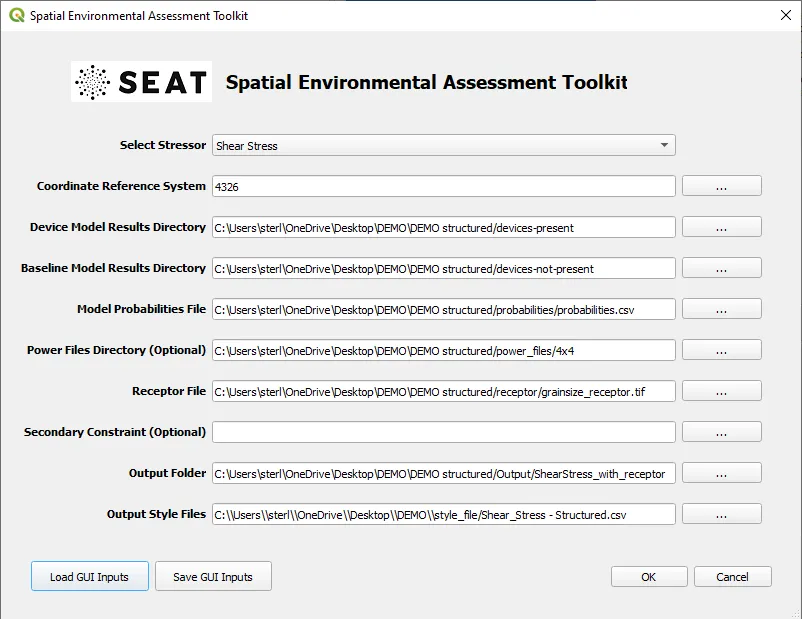
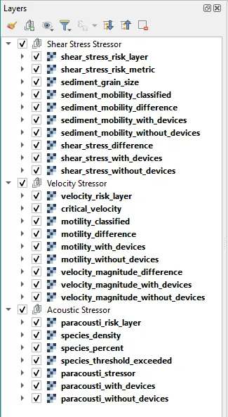

Sedimentation & Power Generation
--------------------------------------------

Input
""""""

If you have not done so before, you will need to create input files for the default files provided. To do so, navigate to :file:`DEMO/PacWave/`. In that folder, you will find a number of .default files. You need to open these and replace `<input_folder>` with the path to the DEMO structured folder on your machine and ``<style_folder>`` with the path to the style_files folder on your machine. If you use python, a script titled ``localize_input_files.py`` will do this for you. You can run this script by navigating to the DEMO folder in a terminal and typing ``python localize_input_files.py``. If you do not have python, you can open the files in a text editor and replace the text manually or with a find and replace feature. If changing via a text editor, save the file as a .ini file.

Example use of the script is shown below. After running the script, .ini files will appear in the DEMO structured folder. These are the files you will use to load the inputs into the SEAT GUI.

.. code-block:: bash
   
   $ python localize_input_files.py 

.. code-block:: none

   Where are your input files? C:\DEMO Files\PacWave
   Where is your style_files folder? C:\DEMO Files\style_files

.. To run this demonstration, use the **Load GUI Inputs** button located at the bottom left of the SEAT GUI, navigate to :file:`DEMO/PacWave/all_modules.ini.ini`, and click OK to load the inputs. If you need detailed instructions on how to load inputs, please refer to the :ref:`save_load_config` section in the :ref:`gui` documention.

For this case we will use ``PacWave/all_modules.ini``. This file contains the following inputs:

- This set of inputs includes model results and receptor layers for the Shear Stress, Velocity, Acoustics, and Power Module
- Power generation files at .OUT files with georeferencing in .pol files
- The SWAN model files are concatenated into a single .nc file

To start the analysis click OK. The analysis will take a few minutes to run. If an error occurs, a yellow bar will appear at the top of the QGIS window. Click Show Stack Trace to see the error message. Most likely the error is due to a missing input file or incorrect file path. Make sure you have created the .csv files in the style_files folder and that the paths in the .ini files are correct. If you are still having trouble please contact the SEAT team by creating an issue on the SEAT GitHub page detailing how you arrived at the error, what the error is, and what you have checked so far.

Output
""""""

If you are using the default QGIS layout, after succesfully running SEAT you will see three layers groups added to the Layers Panel. 

Each layer will group corresponds to the module output as shown below. To add the map layer, see the :ref:`quick_map_services` section.