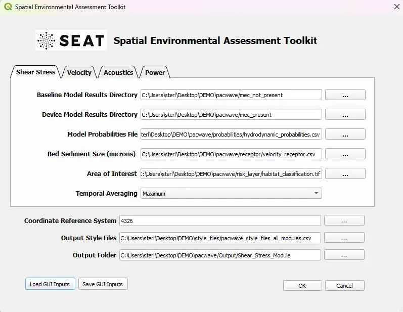

Sedimentation Analysis (Shear Stress)
^^^^^^^^^^^^^^^^^^^^^^^^^^^^^^^^^^^^^

This tutorial will use SEAT to evaluate the impact of WEC devices.

Input
""""""
At this point you should have setup the input files and style files as detailed in :ref:`prepare_tutorial_files`.

To run this demonstration, use the **Load GUI Inputs** button located at the bottom left of the SEAT GUI, navigate to :file:`DEMO/pacwave/shear_stress_module.ini`, and click OK to load the inputs. If you need detailed instructions on how to load inputs, please refer to the :ref:`save_load_config` section in the :ref:`seat_qgis_plugin` documention.

.. Note::
   Your paths will differ from the ones shown in the example below. If you get an error double check the paths making sure the files exist at the specified location.

Output
""""""

The above example case evaluates the impact on sediment mobility considering a single median grain size receptor in a CSV file. The probability-weighted shear stress with devices is compared to the scenario without devices. The resulting stressor (change in shear stress), stressor with receptor (change in sediment mobility), and the reclassified stressor from the analysis are illustrated below.

Some example output layers are shwown in the Figure below. To add the map layer see the :ref:`quick_map_services` section. 

.. list-table:: 
   :widths: 50 50
   :class: image-matrix

   * - .. image:: ../../media/pacwave_shear_stress_layers.webp
         :scale: 100 %
         :alt: Layers
         :align: center

       .. raw:: html

          
Layers Legend

     - .. image:: ../../media/pacwave_shear_stress_area_of_interest.webp
         :scale: 35 %
         :alt: Sediment Area of Interest
         :align: center

       .. raw:: html

          
Sediment Area of Interest

   * - .. image:: ../../media/pacwave_shear_stress_mobility_difference.webp
         :scale: 35 %
         :alt: Sediment Mobitility Difference
         :align: center

       .. raw:: html

          
Sediment Mobitility Difference

     - .. image:: ../../media/pacwave_shear_stress_stressor.webp
         :scale: 35 %
         :alt: Shear Stress Difference
         :align: center

       .. raw:: html

          
Shear Stress Difference

**Output Files**

Additional output files can be found in the specifed Output folder.

.. code-block::

   Output
   └───Shear_Stress_Module
      └───Shear Stress Module
               sediment_grain_size.tif
               sediment_mobility_classified.csv
               sediment_mobility_classified.tif
               sediment_mobility_classified_at_sediment_grain_size.csv
               sediment_mobility_difference.csv
               sediment_mobility_difference.tif
               sediment_mobility_difference_at_sediment_grain_size.csv
               sediment_mobility_difference_at_shear_stress_area_of_interest.csv
               sediment_mobility_without_devices.tif
               sediment_mobility_with_devices.tif
               shear_stress_difference.csv
               shear_stress_difference.tif
               shear_stress_difference_at_secondary_constraint.csv
               shear_stress_difference_at_sediment_grain_size.csv
               shear_stress_area_of_interest.tif
               shear_stress_risk_metric.csv
               shear_stress_risk_metric.tif
               shear_stress_risk_metric_at_sediment_grain_size.csv
               shear_stress_risk_metric_at_shear_stress_area_of_interest.csv
               shear_stress_without_devices.tif
               shear_stress_with_devices.tif
