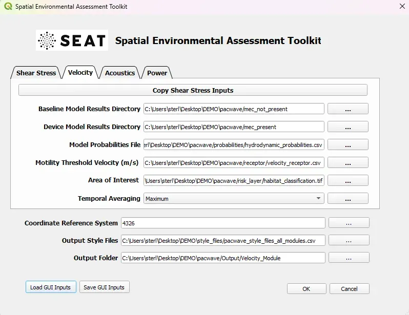

Larval Transport Analysis (Velocity)
^^^^^^^^^^^^^^^^^^^^^^^^^^^^^^^^^^^^

This set of inputs evaluates the impact on larval motility given a single critical velocity receptor in a CSV file.

Input
""""""

At this point you should have already setup the input files and style files as detailed in :ref:`prepare_tutorial_files`.

To run this demonstration, use the **Load GUI Inputs** button located at the bottom left of the SEAT GUI, navigate to :file:`DEMO/pacwave/velocity_module.ini`, and click OK to load the inputs. If you need detailed instructions on how to load inputs, please refer to the :ref:`save_load_config` section in the :ref:`seat_qgis_plugin` documention.

.. Note::
   Your paths will differ from the ones shown in the example below. If you get an error double check the paths making sure the files exist at the specified location.

Output
""""""
  
For this case the velocity with devices is compared to the velocity without devices and a difference (stressor) is calculated.

.. list-table:: 
   :widths: 50 50
   :class: image-matrix

   * - .. image:: ../../media/pacwave_velocity_layers.webp
         :scale: 100 %
         :alt: Layers
         :align: center

       .. raw:: html

          
Layers Legend

     - .. image:: ../../media/pacwave_velocity_risk_layer.webp
         :scale: 25 %
         :alt: Risk Layer
         :align: center

       .. raw:: html

          
Velocity Risk Layer

   * - .. image:: ../../media/pacwave_motility_difference.webp
         :scale: 25 %
         :alt: Motility Difference
         :align: center

       .. raw:: html

          
Motility Difference

     - .. image:: ../../media/pacwave_velocity_difference.webp
         :scale: 25 %
         :alt: Velocity Difference
         :align: center

       .. raw:: html

          
Velocity Difference

**Output Files**

Additional output files can be found in the specifed Output folder.

.. code-block::

    Output
    └───Velocity Module
        └───Velocity Module
                critical_velocity.tif
                motility_classified.csv
                motility_classified.tif
                motility_classified_at_critical_velocity.csv
                motility_classified_at_velocity_risk_layer.csv
                motility_difference.csv
                motility_difference.tif
                motility_difference_at_critical_velocity.csv
                motility_difference_at_velocity_risk_layer.csv
                motility_without_devices.tif
                motility_with_devices.tif
                velocity_magnitude_difference.csv
                velocity_magnitude_difference.tif
                velocity_magnitude_difference_at_critical_velocity.csv
                velocity_magnitude_difference_at_velocity_risk_layer.csv
                velocity_magnitude_without_devices.tif
                velocity_magnitude_with_devices.tif
                velocity_risk_layer.tif
