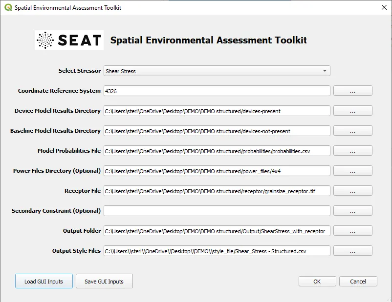
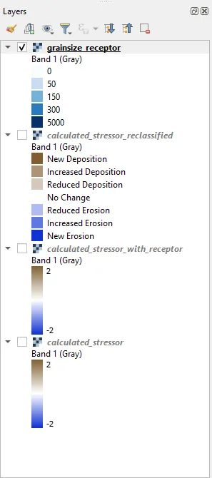

Sedimentation & Power Generation
--------------------------------------------

Input
""""""

If you have not done so before you will need to create input files for the default files provided. To do so naviage to :file:`DEMO/structured DEMO/`. In that folder you will find a number of .default files. You need to open these and replace ``<input_folder>`` with the path to the DEMO unstructured folder on your machine and ``<style_folder>`` with the path to the style_files folder on your machine. If you use python a script titled ``localize_input_files.py`` will do this for you. You can run this script by navigating to the DEMO unstructured folder in a terminal and typing ``python localize_input_files.py``. If you do not have python you can open the files in a text editor and replace the text manually or with a find and replace feature. If changing via a text editor save the file as a .ini file.

Example use of the script is shown below. After running the script .ini files will appear in the DEMO unstructured folder. These are the files you will use to load the inputs into the SEAT GUI.

.. code_block::bash
   
   $ python localize_input_files.py 
   Where are your input files? C:\\Users\\sterl\\OneDrive\\Desktop\\DEMO\\DEMO structured
   Where is your style_files folder? C:\\Users\\sterl\\OneDrive\\Desktop\\DEMO\\style_files

With the *ini files created, use the **Load GUI Inputs** button located at the bottom left of the SEAT GUI, navigate to :file:`DEMO/unstructured DEMO/shear_stress_with_receptor_demo.ini`, and click OK to load the inputs. If you need detailed instructions on how to load inputs, please refer to the :ref:`save_load_config` section in the :ref:`gui` documention.

For this case we will use ``DEMO structured/shear_stress_with_receptor.ini``. This file contains the following inputs:

- This set of inputs includes a GeoTiff of grain sizes as a receptor layer
- power generation files at .OUT files with georeferencing in .pol files
- The SWAN model files are concatenated into a single .nc file

To start the analysis click OK. The analysis will take a few minutes to run. If an error occurs a yellow bar will appear at the top of the QGIS window. Click Show Stack Trace to see the error message. Most likely the error is due to a missing input file or incorrect file path. Make sure you have created the .csv files in the style_files folder and that the paths in the .ini files are correct. If you are still having trouble please contact the SEAT team by creating an issue on the SEAT GitHub page detailing how you arrived at the error, what the error is, and what you have checked so far.

Output
""""""

If you are using the Deafult QGIS layout after succesfully running SEAT you will see four layers added to the Layers Panel. 

Each layer will look as shown below. To add the map layer see the :ref:`map` section. The sedimentation analysis indicates a predominant decrease in sediment erosion and increase in sediment deposition in the lee of the array, with less mobility occurring over larger sediment size classes.

.. list-table:: 
   :widths: 50 50
   :class: image-matrix

   * - .. image:: ../../media/PMEC_grainsize.webp
         :scale: 25 %
         :alt: Grainsize
         :align: center

       .. raw:: html

          
Grainsize

     - .. image:: ../../media/PMEC_stressor_reclassified.webp
         :scale: 25 %
         :alt: Stressor Reclassified
         :align: center

       .. raw:: html

          
Stressor Reclassified

   * - .. image:: ../../media/PMEC_stressor_with_receptor.webp
         :scale: 25 %
         :alt: Stressor with Receptor
         :align: center

       .. raw:: html

          
Stressor with Receptor

     - .. image:: ../../media/PMEC_stressor.webp
         :scale: 25 %
         :alt: Stressor
         :align: center

       .. raw:: html

          
Stressor

The specified output folder contains the following files. Highlighted lines will be shown below.

.. code-block::
  :caption: Output Files created
  :emphasize-lines: 3,13,25  
  :linenos:

   Output
   └───ShearStress_with_receptor
         BC_probability_wPower.csv
         calculated_stressor.csv
         calculated_stressor.tif
         calculated_stressor_at_receptor.csv
         calculated_stressor_reclassified.csv
         calculated_stressor_reclassified.tif
         calculated_stressor_reclassified_at_receptor.csv
         calculated_stressor_with_receptor.csv
         calculated_stressor_with_receptor.tif
         Device Number Location.png
         Device_Power.png
         Obstacle_Locations.png
         Obstacle_Matching.csv
         Power_per_device_annual.csv
         Power_per_device_per_scenario.csv
         receptor.tif
         Scaled_Power_Bars_per_run_obstacle.png
         Scaled_Power_per_device_per_scenario.png
         tau_without_devices.tif
         tau_with_devices.tif
         Total_Scaled_Power_Bars_per_obstacle.png
         Total_Scaled_Power_Bars_per_Run.png
         Total_Scaled_Power_per_Device_.png
         _20231023.log
         _20231024.log

The power generation is saved as individual images and tables in the selected output folder.

.. list-table::
   :widths: 50 50
   :class: image-side-by-side

   * - .. image:: ../../media/Total_Scaled_Power_per_Device.webp
         :scale: 50 %
         :alt: PMEC power generated per device bar plots
         :align: center

       .. raw:: html

          
PMEC power generated per device bar plots

     - .. image:: ../../media/Device_Power.webp
         :scale: 50 %
         :alt: PMEC power generated per device heat map
         :align: center

       .. raw:: html

          
PMEC power generated per device heat map

PMEC power generated per hydrodynamic scenario

+-------+-------+-------+---------------+-------+----------+--------+--------------------+-------------------+
| Hs    | Tp    | Dp    | % of dir bin  | % of  | run      | Exclude| Power_Run_Name     | Power [W]         |
| [m]   | [s]   | [deg] |               | yr    | order    |        |                    |                   |
+-------+-------+-------+---------------+-------+----------+--------+--------------------+-------------------+
| 1.76  | 6.6   | 221.8 | 15.41         | 0.39  | 6        |        | POWER_ABS_010.OUT  | 9526874.11104     |
+-------+-------+-------+---------------+-------+----------+--------+--------------------+-------------------+
| 2.67  | 8.62  | 220.8 | 40.68         | 1.029 | 16       |        | POWER_ABS_004.OUT  | 7461649.7576523   |
+-------+-------+-------+---------------+-------+----------+--------+--------------------+-------------------+
| 4.06  | 10.16 | 221.3 | 23.47         | 0.593 | 20       |        | POWER_ABS_021.OUT  | 55647583.948375   |
+-------+-------+-------+---------------+-------+----------+--------+--------------------+-------------------+
| 1.37  | 15.33 | 224.0 | 8.06          | 0.204 | 2        |        | POWER_ABS_014.OUT  | 7647446.853708    |
+-------+-------+-------+---------------+-------+----------+--------+--------------------+-------------------+
| 7.05  | 12.6  | 223.6 | 3.42          | 0.086 | 24       | x      | POWER_ABS_008.OUT  | 1557004.364389    |
+-------+-------+-------+---------------+-------+----------+--------+--------------------+-------------------+
| 2.11  | 11.63 | 223.8 | 8.96          | 0.227 | 11       |        | POWER_ABS_001.OUT  | 2096482.510244    |
+-------+-------+-------+---------------+-------+----------+--------+--------------------+-------------------+
| 4.91  | 13.62 | 251.2 | 11.99         | 1.764 | 23       |        | POWER_ABS_019.OUT  | 108518849.444376  |
+-------+-------+-------+---------------+-------+----------+--------+--------------------+-------------------+
| 1.7   | 7.73  | 244.8 | 15.03         | 2.212 | 5        |        | POWER_ABS_017.OUT  | 61361227.458748   |
+-------+-------+-------+---------------+-------+----------+--------+--------------------+-------------------+
| 2.69  | 9.8   | 247.6 | 26.75         | 3.937 | 17       |        | POWER_ABS_018.OUT  | 160789701.758536  |
+-------+-------+-------+---------------+-------+----------+--------+--------------------+-------------------+
| 1.23  | 14.62 | 248.8 | 18.54         | 2.729 | 1        |        | POWER_ABS_023.OUT  | 284194057.07551   |
+-------+-------+-------+---------------+-------+----------+--------+--------------------+-------------------+
| 2.31  | 17.54 | 249.4 | 3.97          | 0.584 | 14       |        | POWER_ABS_006.OUT  | 4375975.620376    |
+-------+-------+-------+---------------+-------+----------+--------+--------------------+-------------------+
| 2.94  | 11.77 | 250.6 | 23.72         | 3.49  | 18       |        | POWER_ABS_016.OUT  | 73690186.40957    |
+-------+-------+-------+---------------+-------+----------+--------+--------------------+-------------------+
| 4.9   | 14.43 | 275.8 | 8.78          | 4.698 | 22       | x      | POWER_ABS_020.OUT  | 274670833.036     |
+-------+-------+-------+---------------+-------+----------+--------+--------------------+-------------------+
| 1.54  | 8.62  | 278.0 | 20.9          | 11.188| 4        |        | POWER_ABS_011.OUT  | 206396778.152828  |
+-------+-------+-------+---------------+-------+----------+--------+--------------------+-------------------+
| 3.66  | 12.0  | 277.2 | 20.95         | 11.212| 19       | x      | POWER_ABS_022.OUT  | 1149464816.402932 |
+-------+-------+-------+---------------+-------+----------+--------+--------------------+-------------------+
| 2.16  | 10.71 | 277.5 | 25.39         | 13.589| 12       |        | POWER_ABS_002.OUT  | 138944163.638549  |
+-------+-------+-------+---------------+-------+----------+--------+--------------------+-------------------+
| 1.85  | 13.54 | 277.2 | 16.21         | 8.674 | 8        |        | POWER_ABS_009.OUT  | 234565689.801772  |
+-------+-------+-------+---------------+-------+----------+--------+--------------------+-------------------+
| 2.05  | 16.51 | 276.4 | 7.77          | 4.159 | 9        | x      | POWER_ABS_012.OUT  | 76625472.247148   |
+-------+-------+-------+---------------+-------+----------+--------+--------------------+-------------------+
| 1.81  | 9.11  | 298.6 | 28.46         | 8.297 | 7        |        | POWER_ABS_015.OUT  | 205252148.144181  |
+-------+-------+-------+---------------+-------+----------+--------+--------------------+-------------------+
| 2.16  | 13.35 | 295.7 | 10.7          | 3.12  | 13       |        | POWER_ABS_003.OUT  | 12932737.5357336  |
+-------+-------+-------+---------------+-------+----------+--------+--------------------+-------------------+
| 1.49  | 7.12  | 304.6 | 22.86         | 6.664 | 3        |        | POWER_ABS_024.OUT  | 1933807850.66     |
+-------+-------+-------+---------------+-------+----------+--------+--------------------+-------------------+
| 2.66  | 11.02 | 297.2 | 26.48         | 7.72  | 15       |        | POWER_ABS_013.OUT  | 161208626.795492  |
+-------+-------+-------+---------------+-------+----------+--------+--------------------+-------------------+
| 2.08  | 16.53 | 295.6 | 5.28          | 1.54  | 10       |        | POWER_ABS_007.OUT  | 13757051.63756    |
+-------+-------+-------+---------------+-------+----------+--------+--------------------+-------------------+
| 4.65  | 13.23 | 296.2 | 6.22          | 1.813 | 21       |        | POWER_ABS_005.OUT  | 15581540.517641   |
+-------+-------+-------+---------------+-------+----------+--------+--------------------+-------------------+

            