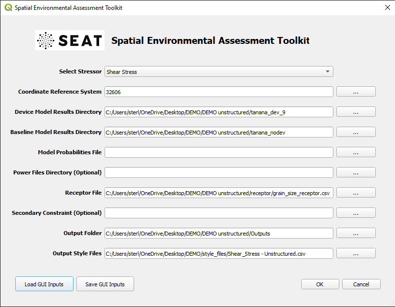
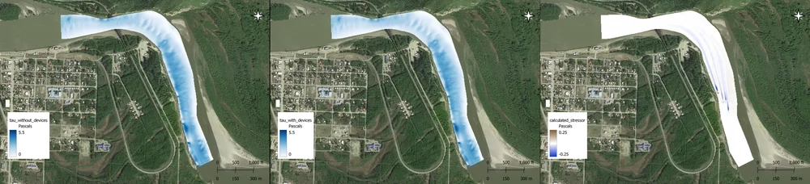
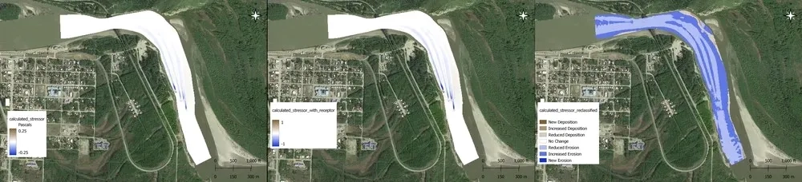
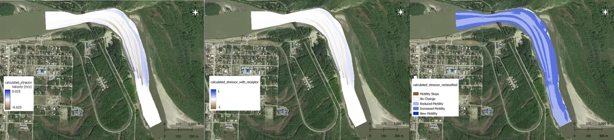

Tanana River Analysis
=====================

The Tanana River, situated in central Alaska, is being evaluated as a potential site for harnessing current energy. The nearby town of Nenana, nestled on the inner bank of a river bend, could significantly benefit from local energy generation as opposed to relying on diesel generators. A current energy capture device has undergone testing on-site, and ongoing data collection pertaining to local fish populations and benthic characteristics is expected to provide a robust understanding of the long-term impact of device deployment on the ecosystem. A model was created on an unstructured grid using DFlow-FM to simulate various flow return periods with device arrays. The flow scenarios are examined both under baseline conditions (no devices present) and with devices deployed.

Accessing Demonstration Files
^^^^^^^^^^^^^^^^^^^^^^^^^^^^^

To access the demonstration files relevant to this analysis, please refer to the section :ref:`tutorial-files-access`. This demonstration utilizes the :file:`DEMO unstructured` and :file:`style_files` folders as detailed in :ref:`DEMO_files`. A comprehensive list of files contained in the unstructured folder is available in :ref:`unstructured_files`.

Sedimentation Analysis (Shear Stress)
^^^^^^^^^^^^^^^^^^^^^^^^^^^^^^^^^^^^^

Evaluate the impact of CEC devices on sediment mobility considering a single median grain size receptor in a CSV file.

Input
""""""

To begin, use the **Load GUI Inputs** button located at the bottom left of the SEAT GUI, navigate to :file:`DEMO/unstructured DEMO/shear_stress_with_receptor_demo.ini`, and click OK to load the inputs. If you need detailed instructions on how to load inputs, please refer to the :ref:`save_load_config` section in the :ref:`gui` documention.

Refer to :ref:`unstructured_files` for details on the model data which consists of individual .nc files for each flow return period. The period within the .nc filename determines the probability of occurrence.

.. Important::
   Ensure to reset the complete path to match the location on your machine. The initial inputs will look as shown below, but they must be adjusted to reflect the path on your local machine. 

Create an Output folder corresponding to the path you have set, as this is where the analysis outputs will be saved.

Output
""""""

The above input set evaluates the impact on sediment mobility considering a single median grain size receptor in a CSV file. The probability-weighted shear stress with devices is compared to the scenario without devices.

The resulting stressor (change in shear stress), stressor with receptor (change in sediment mobility), and the reclassified stressor from the analysis are illustrated below.

Larval Transport Analysis (Velocity)
^^^^^^^^^^^^^^^^^^^^^^^^^^^^^^^^^^^^

- Example model input can be found in "DEMO unstructured/velocity_with_receptor_demo.ini"

  * This set of inputs evaluates the impact on larval motility given a single critical velocity receptor in a CSV file.
  
  For this case the velocity with devices is compared to the velocity without devices and a difference (stressor) is calculated.

List of Files
^^^^^^^^^^^^^

.. _unstructured_files:

..  code-block:: none
  :caption: DEMO unstructured Directory 
  :emphasize-lines: 44, 45

   DEMO
   ├───DEMO unstructured
   │   │   shear_stress_no_receptor_demo.ini
   │   │   shear_stress_with_receptor_demo.ini
   │   │   velocity_no_receptor_demo.ini
   │   │   velocity_with_receptor_demo.ini
   │   │
   │   ├───boundary-condition
   │   │       boundar_condition.csv
   │   │
   │   ├───receptor
   │   │       grain_size_receptor.csv
   │   │       velocity_receptor.csv
   │   │
   │   ├───tanana_dev_1
   │   │       1_tanana_100_map.nc
   │   │       1_tanana_10_map.nc
   │   │       1_tanana_1_map.nc
   │   │       1_tanana_25_map.nc
   │   │       1_tanana_50_map.nc
   │   │       1_tanana_5_map.nc
   │   │
   │   ├───tanana_dev_9
   │   │       9_tanana_100_map.nc
   │   │       9_tanana_10_map.nc
   │   │       9_tanana_1_map.nc
   │   │       9_tanana_25_map.nc
   │   │       9_tanana_50_map.nc
   │   │       9_tanana_5_map.nc
   │   │
   │   └───tanana_nodev
   │           0_tanana_100_map.nc
   │           0_tanana_10_map.nc
   │           0_tanana_1_map.nc
   │           0_tanana_25_map.nc
   │           0_tanana_50_map.nc
   │           0_tanana_5_map.nc
   │
   └───style_files
      │   Acoustics_blue_whale - Copy.csv
      │   Acoustics_blue_whale.csv
      │   Acoustics_fake_whale.csv
      │   Shear_Stress - Structured.csv
      │   Shear_Stress - Unstructured.csv
      │   Velocity.csv
      │
      └───Layer Style
               acoustics_density_demo.qml
               acoustics_percent_demo.qml
               acoustics_stressor_bluewhale.qml
               acoustics_stressor_demo.qml
               acoustics_threshold_demo.qml
               receptor_blues.qml
               shear_stress_continuous.qml
               shear_stress_continuous_unstructured.qml
               shear_stress_receptor_classified.qml
               shear_stress_receptor_continuous.qml
               shear_stress_reclass.qml
               velocity_continuous_stressor_vik.qml
               velocity_continuous_stressor_with_receptor.qml
               velocity_motility_classification_vik.qml