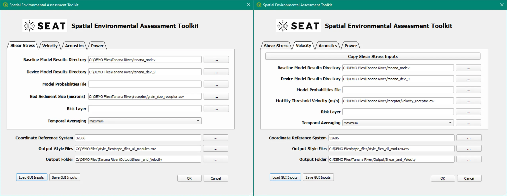

Sedimentation Analysis (Shear Stress)
^^^^^^^^^^^^^^^^^^^^^^^^^^^^^^^^^^^^^

Evaluate the impact of CEC devices on sediment mobility considering a single median grain size receptor in a CSV file.

Input
""""""
At this point you should have already setup the input files as detailed in :ref:`preparing_input_files` and prepared the style files as detailed in :ref:`prepare_style_files`. 

.. To run this demonstration, use the **Load GUI Inputs** button located at the bottom left of the SEAT GUI, navigate to :file:`DEMO/Tanana River/Shear_and_Velocity_with_receptor.ini`, and click OK to load the inputs. If you need detailed instructions on how to load inputs, please refer to the :ref:`save_load_config` section in the :ref:`gui` documention.

To see a full list of files used in the demonstartion please refer to :ref:`tanana_river_files`. In brief, The model data consists of individual .nc files for each flow return period. The period within the ``.nc`` filename determines the probability of occurrence. There is a set of results for no device and a set of results for 9 devices in the river.

.. Important::
   Before clicking OK ensure the complete path matches the location on your machine. Your paths will be different than the ones shown in the example below.

