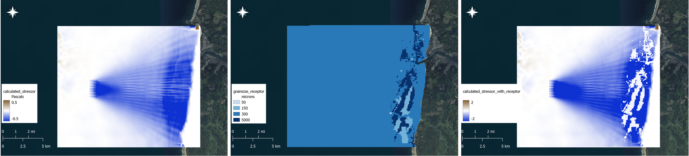
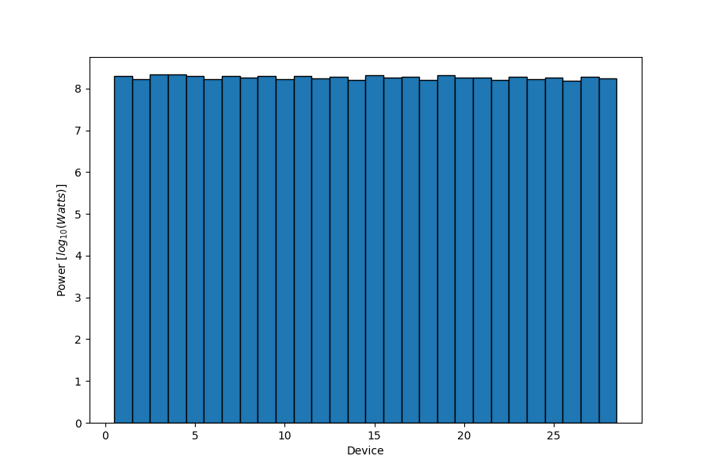
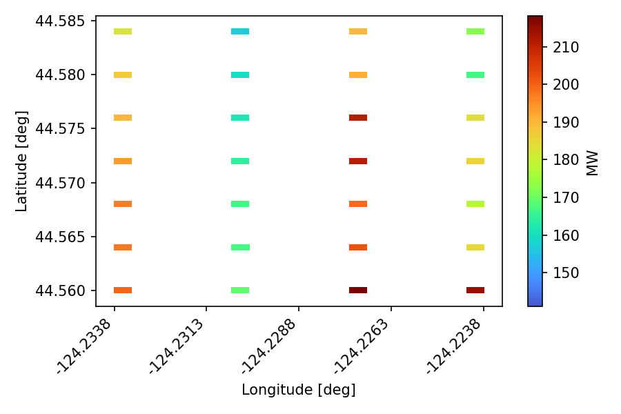
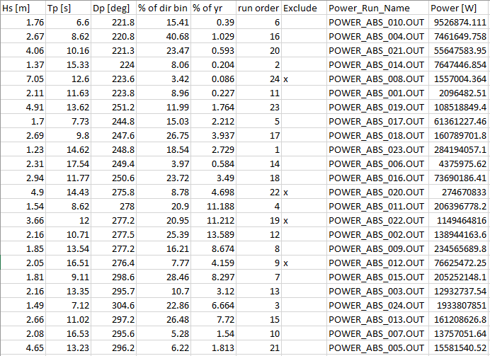
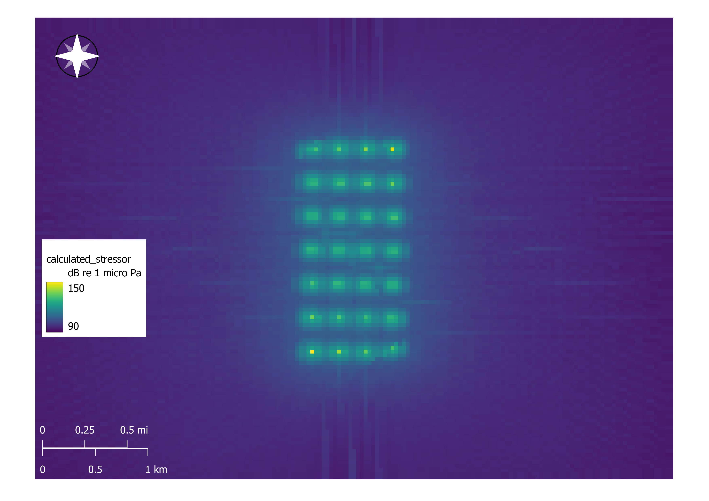
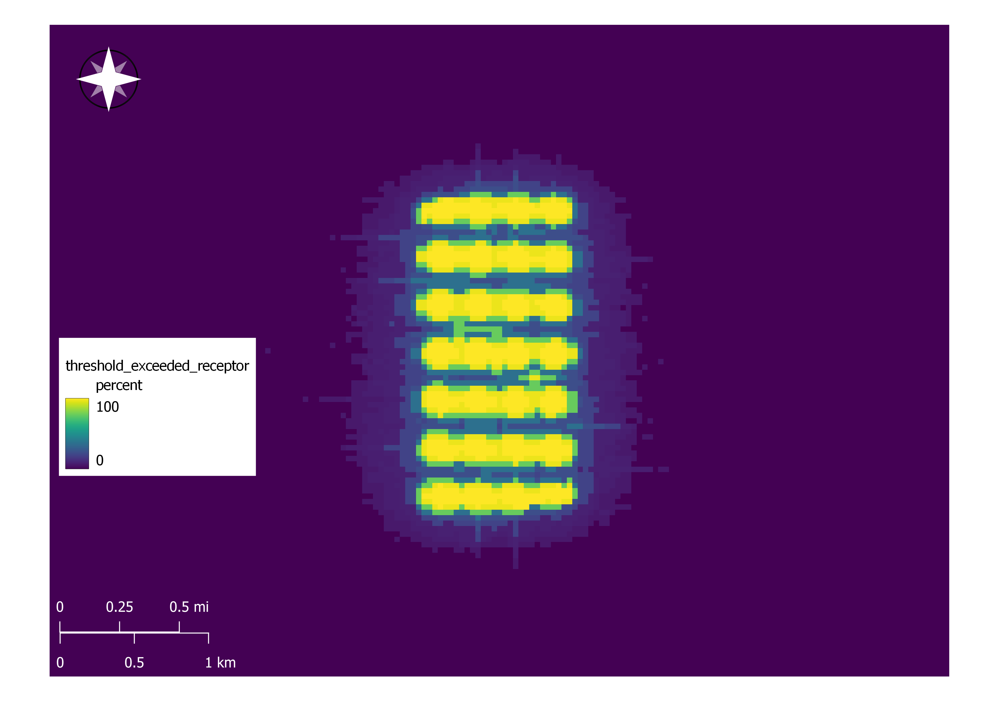

.. _tutorials:

==========
Tutorials
==========

Tutorial Files Access
=====================

Access to the tutorial files is available upon request. Please send an email to `Tim Nelson <tnelson@integral-corp.com>` or `Sam McWilliams <smcwilliams@integral-corp.com>`. Use Subject: SEAT Tutorial File Access. Include your name, company/institution, and intended use in the body of the email. If you have a suggestions please enter the comment on the GitHub page.

===========
Tanan River
===========

The Tanana River located in central Alaska is being considered as a viable site for current energy capture. The town of Nenana, located on the inner bank of a bend in the river, could benefit from locally generated energy rather than diesel generators. A current energy capture device has been tested on site and ongoing data collection events, related to local fish populations and benthic characteristics, could allow for a robust characterization of the impact a long-term deployment could have on the system. A model was developed on an unstructured grid in DFlow-FM to simulate a range of flow return periods with device arrays present. The flow cases are applied to both baseline (no devices present) conditions and with devices present. 

Sedimentation Analysis
----------------------

- Example model input can be found in "./DEMO unstructured/shear_stress_with_receptor_demo.ini"
  The model data consists of individual .nc files for each flow return period. The flow period within .nc filename is used to determine the probability of occurrence.

  * This set of inputs evaluates the impact on sediment mobility given a single median grain size receptor in a CSV file.
  For this case the probability weighted shear stress for model runs with devices is compared to the probability weighted shear stress without devices.

.. figure:: media/cec_tutorial_shear_inputs.png
   :scale: 100 %
   :alt: Tanana sedimentation example input

 * The calculated stressor (change in shear stress difference), stressor with receptor (change in sediment mobility), and the reclassified stressor from the analysis are shown below.

.. figure:: media/cec_tutorial_shear_risks.png
   :scale: 100 %
   :alt: Tanana sedimentation example risk

Larval Transport Analysis
-------------------------

- Example model input can be found in "DEMO unstructured/velocity_with_receptor_demo.ini"

  * This set of inputs evaluates the impact on larval motility given a single critical velocity receptor in a CSV file.
  For this case the velocity with devices is compared to the velocity without devices and a difference (stressor) is calculated.

.. figure:: media/cec_tutorial_velocity_risk.png
   :scale: 100 %
   :alt: Tanana velocity example risk

===========
PMEC Site
===========

The Pacific Marine Energy Center (PMEC) is a designated area for marine energy testing on the coast of Oregon. This site has been the focus of model development and SEAT application. A coupled hydrodynamic and wave model was developed using SNL-SWAN and Delft3D-Flow. A range of site conditions is listed in the Model Probabilities File. This site includes information regarding sediment grain size, device power generation, and acoustic effects.

Sedimentation Analysis and Power Generation
-------------------------------------------

- Example model input can be found in "DEMO structured/shear_stress_with_receptor.ini"
This set of inputs includes a GeoTiff of grain sizes as a receptor layer, power generation files at .OUT files with georeferencing in .pol files. The model files are concatenated into a single .nc file.

* The sedimentation analysis indicates a predominant decrease in sediment erosion and increase in sediment deposition in the lee of the array, with less mobility occurring over larger sediment size classes.

* The power generation is saved as individual images and tables in the selected output folder

Acoustic Effects
----------------

The acoustic effects from the WEC array at PMEC can be evaluated using the Acoustic module in the SEAT GUI. This module reads in individual Paracousti model .nc files that correspond to wave conditions. 
For a given probability of occurrence of each wave condition the combined annual acoustic effects can be estimated. SEAT generates a similar stressor layer consisting of the difference between the acoustic effects with and without the array. With a provided receptor file which consists of information regarding the species, threshold value, weighting, and variable used, a threshold map is generated as a percentage of time (based on the probability distribution) that a threshold will be exceeded. For demonstration purposes, an artificially low threshold is used to generate the percent exceeded threshold figure below.

